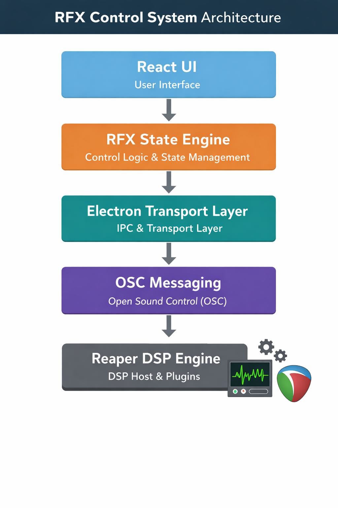

## RFX — Real-Time Audio Routing Platform

Real-time audio routing and control interface built with **React**, **Electron**, and **OSC messaging** to manipulate digital signal processing chains inside a DAW environment.

The system provides a graphical control surface for routing audio, controlling plugin parameters, and mapping hardware or macro controls to DSP parameters.


*Perform view showing real-time bus controls and macro knobs.*


*Edit view used for managing plugin chains and parameter controls.*

---

## Overview

RFX explores how modern web technologies can be used to build responsive control systems for digital audio processing environments.

The platform communicates with a DSP host (**Reaper**) using **OSC messaging**, allowing the UI to manipulate plugin parameters and routing configuration in real time.

The system architecture separates:

- UI rendering
- control/state management
- transport and DSP communication

This separation allows the interface to remain responsive while synchronizing with the DSP engine.

---

## Architecture

RFX uses a layered control architecture connecting the UI to the DSP host.


*Edit view used for managing plugin chains and parameter controls.*

Each layer is responsible for a specific part of the control pipeline.

---

## System Components

### React UI

The React frontend renders the control surface and signal routing interface.

Responsibilities include:

- Rendering control components
- Displaying signal routing state
- Capturing user interaction
- Providing real-time UI feedback

---

### State Engine

The state engine maintains the canonical representation of the signal routing system.

Responsibilities include:

- Managing control state
- Handling parameter mappings
- Processing user intent
- Synchronizing UI state with DSP state

---

### Electron Transport Layer

Electron provides the bridge between the UI and the system environment.

Responsibilities include:

- IPC messaging between processes
- Communication with external scripts
- Managing transport of control messages

---

### OSC Communication

RFX uses **Open Sound Control (OSC)** for real-time messaging between the UI and the DSP engine.

OSC messages allow the system to:

- Update plugin parameters
- Synchronize DSP state with the UI
- Maintain low-latency control of audio processing

---

### DSP Host (Reaper)

The DSP environment runs inside **Reaper**, which hosts the audio processing chain and plugins.

Reaper scripts handle:

- Applying parameter updates
- Managing routing configuration
- Exporting DSP state back to the control system

---

## Tech Stack

- React
- Electron
- Node.js
- OSC (Open Sound Control)
- Zustand state management
- Reaper API
- Lua scripting

---

## Features

- Real-time control of audio processing parameters
- Visual signal chain editing interface
- Plugin parameter sliders and automation controls
- Parameter-to-control mapping system
- Macro controls for manipulating multiple parameters simultaneously
- Integration with external hardware controllers (MIDI, rotary encoders, switches)

---

## Example Control Flow

A typical interaction follows this path:

```
User interaction (UI or hardware)
        ↓
Control intent generated
        ↓
State engine updates control state
        ↓
Transport layer sends OSC message
        ↓
DSP engine updates plugin parameter
        ↓
DSP state exported back to control system
        ↓
UI re-renders updated state
```

This control flow ensures the UI and DSP engine remain synchronized.

---

## Project Goals

RFX explores how **modern frontend technologies and real-time messaging systems** can be used to build flexible control surfaces for audio processing workflows.

The project focuses on combining:

- web UI frameworks
- real-time control systems
- digital signal processing environments
- hardware/software integration

---

## Future Improvements

Potential future enhancements include:

- Expanded macro control systems
- Deeper hardware integration
- Spatial audio control features
- Plugin preset management
- Improved routing visualization

---

## Author

Joshua Darby

GitHub  
https://github.com/Waduhekthecat